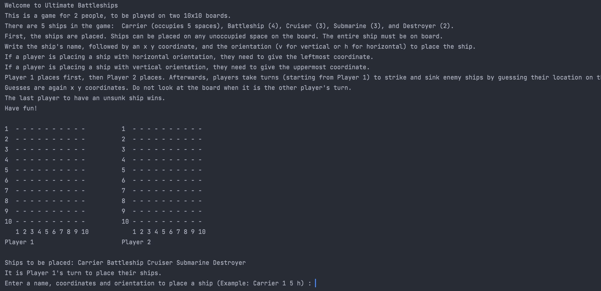
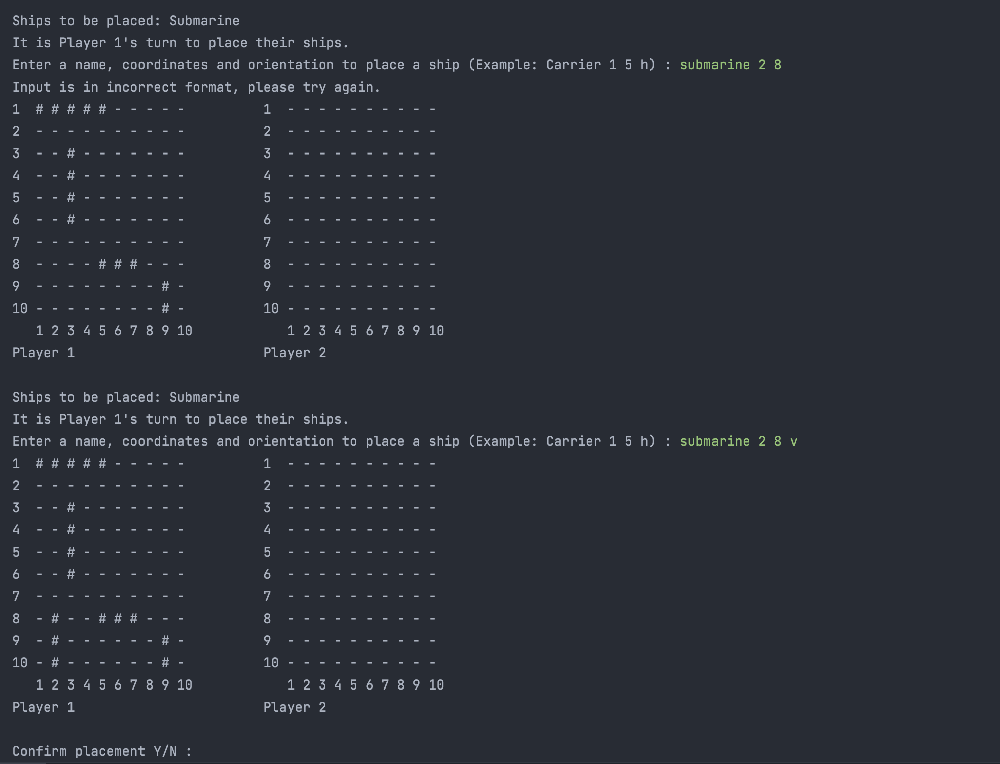

# Battleship-Game

🎮 A complete battleship game, which can be played in the terminal. 

The game consists of 2 parts. 

🎯 In the first part, the ships are placed. There are 5 different kinds of ships with different sizes. Players can choose the coordinates and the orientation  (vertical or horizontal) of the ships. After all the ships are placed, the first user is asked the confirm the placement. Then the second player takes the turn and places their ships. When the both players are done placing their ships, the second part begings: the war!

💣 In the second part, the users try to guess where the other user placed the ships and try to shoot the ships by typing the coordinates they want to shoot. The first player to submerge all the ships of the oppenent wins!

